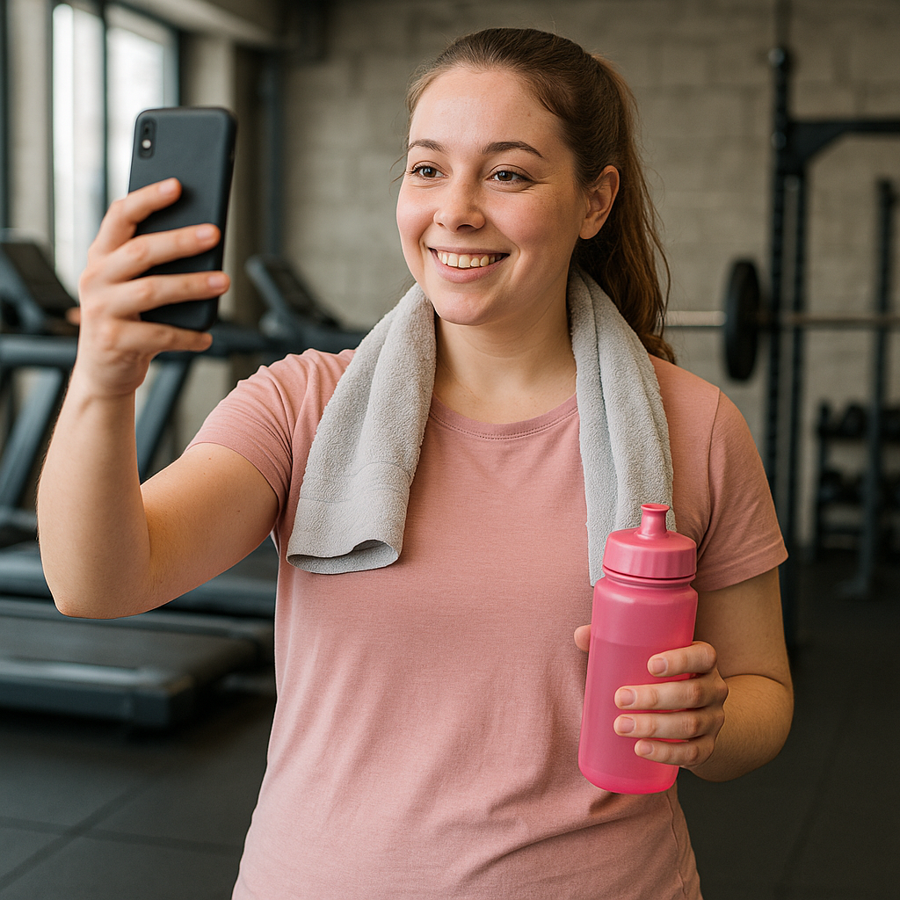
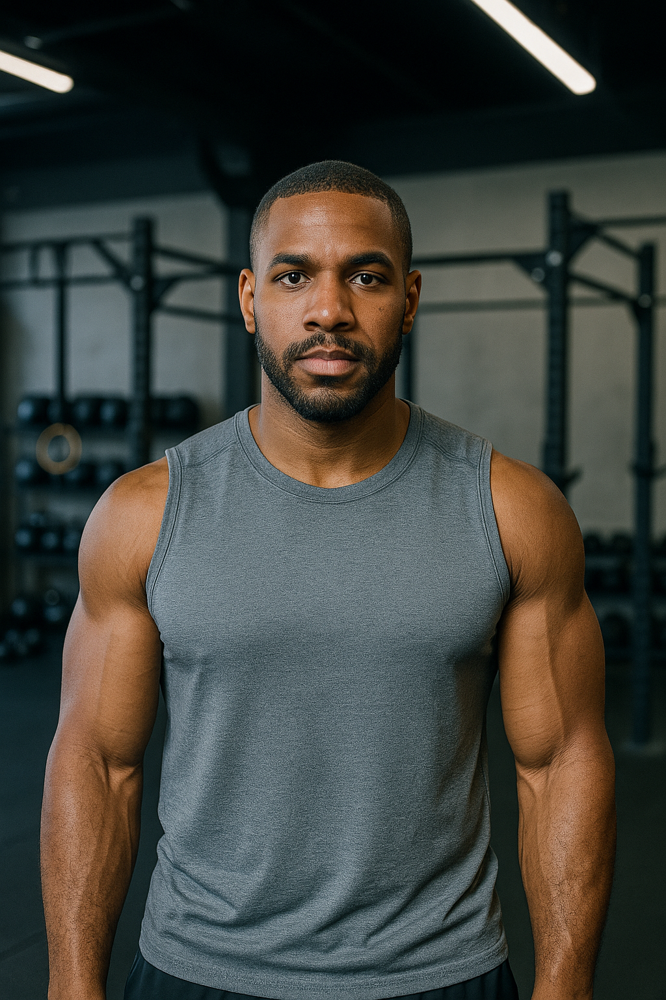

# Gym Web Application Documentation

## Table of Contents
1. [User Personas](#user-personas)
2. [Information Architecture](#information-architecture)
3. [Website Sitemap](#website-sitemap)

---

## 1. User Personas 

### Persona 1: Emma Johnson — The Fitness Beginner

**Demographics:**  
- Age: 28  
- Gender: Female  
- Location: Austin, TX  
- Occupation: Elementary School Teacher

**Background:**  
Emma recently decided to adopt a healthier lifestyle. She’s new to gyms and has never followed a structured fitness plan. She uses her smartphone regularly but isn’t very tech-savvy.

**Goals:**  
- Lose 15 pounds  
- Improve stamina and reduce stress  
- Stick to a consistent fitness routine

**Needs:**  
- A simple, beginner-friendly interface  
- Guided workout plans with video tutorials  
- Motivation tools like reminders and progress tracking  
- Supportive community or coach access

---

### Persona 2: Marcus Reid — The Busy Professional

**Demographics:**  
- Age: 35  
- Gender: Male  
- Location: Chicago, IL  
- Occupation: Software Engineer

**Background:**  
Marcus works long hours and travels often. He previously maintained a good fitness regimen but has fallen behind. He wants flexibility and efficiency when managing workouts. He’s highly tech-savvy.

**Goals:**  
- Regain muscle tone and energy  
- Fit workouts into a packed schedule  
- Track health stats like calories, heart rate, and steps

**Needs:**  
- Mobile-first design and sync with wearables  
- Quick-access plans (20–30 min workouts)  
- Personalized dashboard and calendar integration  
- Blog content and research-driven fitness advice

---

### Persona 3: Susan Patel — The Active Retiree

**Demographics:**  
- Age: 62  
- Gender: Female  
- Location: Portland, OR  
- Occupation: Retired (Former Librarian)

**Background:**  
Susan enjoys staying active through walking, yoga, and light strength training. She’s interested in maintaining mobility, heart health, and social connection. She uses a tablet daily.

**Goals:**  
- Maintain physical and mental health  
- Stay socially engaged  
- Avoid injuries and joint stress

**Needs:**  
- Low-impact workout programs tailored for older adults  
- Large fonts and easy navigation  
- Access to online classes and wellness content  
- Community forums or group classes

---

## 2. Information Architecture 

### Persona 1: Emma Johnson — The Fitness Beginner (24, Student)

**Category A: Getting Started**  
1. How to Create a Workout Schedule  
2. Intro to Gym Equipment  
3. Beginner Workout Plans (No Weights)  
4. Basic Cardio vs. Strength Training  
5. Bodyweight Workouts at Home  

**Category B: Motivation & Support**  
6. Staying Motivated on Busy Days  
7. Fitness Journaling and Habit Tracking  
8. Dealing with Gym Anxiety  
9. Setting SMART Fitness Goals  
10. Community Challenges for Beginners  

**Category C: Health & Learning**  
11. Simple Meal Prep Ideas  
12. Understanding Macros and Calories  
13. Beginner Sleep Hygiene Tips  
14. Avoiding Common Workout Injuries  
15. How to Choose the Right Shoes & Gear  

---

### Persona 2: Marcus Reid — The Fitness Enthusiast (35, Software Engineer)

**Category A: Advanced Training**  
1. Push-Pull-Legs Split Explained  
2. High-Intensity Interval Training (HIIT) for Strength  
3. Periodization and Deloading Techniques  
4. Tracking Gains with Apps  
5. Building Your Own Workout Plan  

**Category B: Optimization & Performance**  
6. The Science Behind Muscle Growth  
7. Optimizing Recovery Time  
8. Pre- and Post-Workout Nutrition  
9. Supplement Guide for Intermediates  
10. Sleep Tracking for Performance  

**Category C: Tools & Tech**  
11. Comparing Fitness Wearables  
12. Connecting Apps (MyFitnessPal, Strava, etc.)  
13. Using Smart Mirrors and AI Trainers  
14. Form-Check Video Uploads  
15. Virtual PT Sessions & Reviews  

---

### Persona 3: Susan Patel — The Busy Professional (41, Lawyer)

**Category A: Time-Efficient Fitness**  
1. 15-Minute Daily Workouts  
2. Stretching Routines for Desk Workers  
3. Office-Friendly Exercises  
4. Lunchtime Express Cardio  
5. Daily Step Challenges  

**Category B: Wellness & Life Balance**  
6. Mindful Movement & Breathing Exercises  
7. Stress Management Through Fitness  
8. Yoga for Beginners  
9. Sleep Optimization for Working Adults  
10. Healthy Snacks for Busy Days  

**Category C: Simplicity & Accessibility**  
11. Easy-to-Navigate Fitness Dashboard  
12. Scheduling Workouts with Your Calendar  
13. Beginner's Guide to Streaming Classes  
14. Working Out While Traveling  
15. Accessing Live Coaching in Off-Hours  

---

## 3. Website Sitemap 

**Home Page**

- Navbar  
  - Login/Register  
  - About 
  - Contact
  - Plans
  - Membership(for logged in users)
  - Blog Page  

- Main Content  
  - Home page content like Hero, FAQ, Testimonials
    
- Footer
