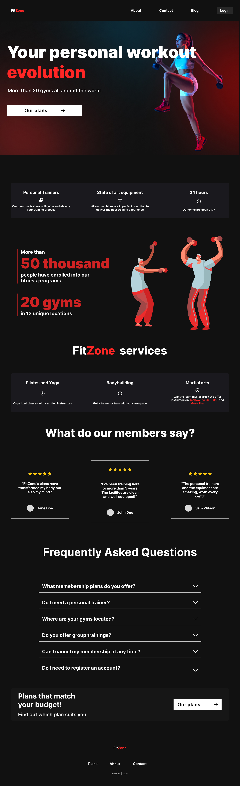

# FitZone Finalni Izvještaj

Izvještaj opisuje iterativni proces stvaranja Next.js web aplikacije naziva **FitZone**, koja oponaša web stranicu teretane sa svim potrebnim informacijama, kao i  procese logiranja i odabiranja plana treninga. Točnije, izvještaj opisuje ključne aspekte razvoja aplikacije poput sitemapa, low i high fidelity prototipova, Normanovih principa dizajna te analize performansi web aplikacije koji su dani u nastavku na sljedećim podstranicama.

**Produkcijska verzija web aplikacije** se nalazi na sljedećem linku:

[Link](link)

## Sadržaj

- [Wireframe](#wireframe)
- [High Fidelity Prototype](#high-fidelity-prototype)
- [Basic Design Principles and Heuristics](#basic-design-principles-and-heuristics)
- [CRAP Design Principles](#crap-design-principles)
- [Low Level Theories](#low-level-theories)
- [Performance Analysis](#performance-analysis)

---

## Wireframe
Sitemap i low fidelity prototype (wireframe) postavljaju temelj za dizajn usmjeren na korisnika, dajući jasan plan za informacijsku arhitekturu i vizualni prikaz početnog sučelja aplikacije. Wireframe je shema (nacrt) koji pomaže programerima i dizajnerima u procesu strukture web aplikacije i olakšava komunikaciju i primjenu ideja. Sitemap predstavlja listu svih stranica web aplikacije.

Sitemap je napravljen korištenjem aplikacije GlooMaps, dok je low fidelity prototype napravljen korištenjem alata Figma.

- Sitemap:

- Low fidelity Wireframe:

## High Fidelity Prototype

Nakon izrade low fidelity prototipa, koji je definirao osnovni raspored elemenata na početnoj stranici, sljedeći korak bio je razvoj high fidelity prototipa. Ovaj prototip prikazuje točan vizualni izgled početne stranice aplikacije. Budući da je razvoj tekao iterativno, neke vizualne značajke konačne verzije aplikacije ipak se razlikuju od onih prikazanih u početnom high fidelity prototipu.

High fidelity prototip izrađen je isključivo za početnu stranicu, dok su ostale stranice tijekom razvoja mijenjane i prilagođavane potrebama aplikacije.

Prototip je izrađen u alatu Figma, pri čemu je prvo razvijena verzija za desktop, a zatim i verzija za mobilne uređaje kako bi se osigurao prilagođen prikaz na manjim ekranima.

- High fidelity prototype:

- Mobile high fidelity prototype:

## Basic Design Principles and Heuristics
Analiza web aplikacije provedena je primjenom Normanovih sedam principa dizajna obrađenih na predavanjima. Korištenje ovih principa doprinosi stvaranju vizualno privlačnog i funkcionalnog dizajna koji naglašava korisničko iskustvo. Sučelje aplikacije ispitano je u kontekstu usklađenosti s navedenim načelima, pri čemu su primjeri iz same aplikacije korišteni za ilustraciju njihove primjene.

## 1. Visibility
_**"Koliko dobro korisnik može uvidjeti trenutno stanje sustava i moguće akcije?"**_

Primjer visibility-a jest navigacijska traka  na vrhu stranice gdje je označena stranica na kojoj se korisnik trenutno nalazi. Naznačenom trenutnom stranicom poštujemo heuristiku koja nalaže vidljivost statusa sustava.

## 2. Feedback
_**"Jesu li rezultati akcija korisnika jasno vidljivi?"**_
Primjer ostvarenja feedbacka-a jest klik gumba za slanje poruke na kontakt stranici. Korisniku se nakon te akcije prikazuje poruka uspjeha da je poruka uspješno poslana. U aplikaciji se primjenjuju ovakve poruke(toast messages) za povratne informacije o uspješnim, ali i neuspješnim korisničkim akcijama.

## 3. Constraints
_**"Na koji način se korisnika ograničava u određenim akcijama u svrhu pravilnog korištenja aplikacije?"**_

Primjer ostvarenja constraints-a je  poruka pogreške na poljima formi za prijavu. U slučaju da podaci nisu unešeni ili su u krivom su formatu, a korisnik pritisne gumb za slanje podatak forme, korisnika se sprječava da nastavi proces ispunjavanja forme, a zatim se porukama upozorenja, koje su pisane jezikom koji je razumljiv korisniku, nalaže pomoć korisnicima da prepoznaju, dijagnosticiraju i oporave se od grešaka.

## 4. Mapping
_**"Koliko je dobra konzistentnost između kontrola, njihovih promjena i rezultata u svijetu?"**_

Primjer ostvarenja mapping-a je korištenje ikona za pridruživanje najvažnijim informacijama o teretani, poput opreme i radnog vremena, koje pomažu korisniku da vizualno asocira određenu akciju sa ikonom.

## 5. Consistency
_**"Sučelje treba biti dizajnirano tako da ima slične operacije i koristi slične elemente za slične zadatke kao i druga ekvivalentna sučelja."**_

Primjeri ostvarenja consistency-a jest primjena ideja tipičnih za stranice za online teretanu poput rasporeda često postavljenih pitanja i call to action gumba koji vodi na ponuđene planove treninga. Na stranici su ta pitanja  postavljena odmah na početnu stranicu u obliku interaktivnih dropdown elemenata za pronalazak svih odgovora. Ovime smo također usklađeni s heuristikom koja nalaže praćenje konzistentnosti i standarda koje su vezane za stranice o teretanama.

## 6. Affordance and signifiers
_**"Atributi objekta koji omogućuju korisnicima ispravno korištenje i određenim signifierima, poput oznaka ili zvuka, navode na odgovarajuće ponašanje."**_

Primjer *signifier*-a na stranici jest kliknuti gumb filtera u *about* sekciji, koji je drugačije boje od ostalih i tako sugerira(uz strelicu prema dolje) da nudi određenu akciju tj. filtriranje lokacija teretana.

## 7. Mental model
_**"Korisnici razumiju sustave i stupaju u interakciju s njima na temelju mentalnih predstava razvijenih iz iskustva."**_

Iskustvo korisnika na stranici usklađejumo s njegovim metalnim modelom pravilnim korištenjem gore navedenih osnovnih prinicpa dizajna, a naročito primjenom consistency-a kroz konvencije tipične za stranice za teretanu.

## CRAP Design Principles
## 1. **Contrast**

_**"Pravilnom primjenom kontrasta možemo istaknuti određene elemente stranice, napraviti jasnu razliku između elemenata koji imaju različitu svrhu, odvući pozornost od manje bitnih elemenata i stvoriti dinamičniji prikaz na stranici."**_

Primjer kontrasta može se uočiti na hero sekciji početne stranice, primjenom kontrasta boja (npr. crvene, crne i bijele boje), kao i u footeru primjenom kontrastnih boja.

## 2. **Repetition**

_**"Ponavljanje određenih vizualnih elemenata dizajna kroz cijelu stranicu doprinosi boljoj organiziranosti, ujednačenju i dosljednosti stranice. Ti elementi mogu biti: boje, oblici, teksture, prostorni odnosi, debljine i veličine linija."**_

Primjer ponavljanja vizulanih elementa dizajna jest primjena istog stila(komponente) često postavljanih pitanja na početnoj stranici te na stranici o planovima treinga. Također, na cijeloj stranici je primijenjen isti font (Inter) uz varijacije u debljini fonta i veličini, kao i ista boja pozadine.

## 3. **Alignment**

_**"Svaki element treba imati neku vizualnu vezu s drugim elementom. Poravnavanje elemenata stvara vizualni tijek na stranici i doprinosi kohezivnijem ukupnom izgledu stranice."**_

Primjer poravnanja jest About  stranica, gdje je vidljiva primjena centralnog poravnanja , dok je na Blog stranici za pojedinačnu objavu primijenjeno centralno poravnanje u redove po dvije objave.

## 4. **Proximity**

_**"Blizina elemenata na stranici upućuje na to jesu li oni povezani ili nisu. Elementi koji su povezani trebaju biti grupirani blizu jedan drugoga."**_

Primjer u kojem blizina upućuje na povezanost elemenata može se vidjeti na Contact  stranici. Polja forme za unos osobnih podataka su jedna cjelina koja se ispunjava u koracima.

## Low Level Theories

## 1. Fitts’ Law

_**"Po Fittsovom zakonu, vrijeme kretanja do elementa na stranici ovisi o tome koliko je on velik i koliko je udaljen od trenutne pozicije korisnika na stranici. Ove varijable optimiziraju se stvaranjem dobro raspoređenih, velikih elemenata i njihovim postavljanjem takvim da budu blizu najvjerojatnije prethodne lokacije korisnika na stranici."**_

## 2. Hick-Hyman Law

_**"Hickov zakon kaže da što više opcija prezentiramo korisniku, to će mu dulje trebati da donesu odluku. Zato je nužno ponuditi najkorisniji skup opcija kako bi se izbjeglo frustriranje korisnika."**_

## Performance Analysis

- Lighthouse izvještaj: